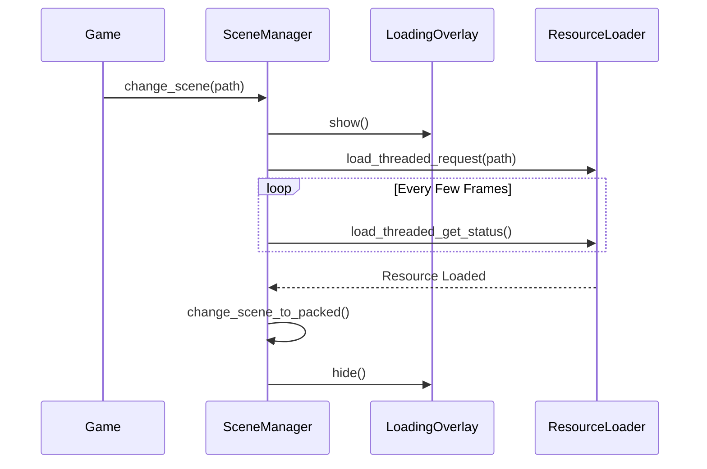

# Core Systems

This folder holds the backbone of the application. These scripts manage the lifecycle of the game and how scenes are swapped.

## SceneManager (`scene_manager.gd`)
Changing scenes in multiplayer is tricky. If the host changes the level but a client is still loading, things break. The SceneManager handles this gracefully:

- It listens for a scene change request.
- It creates a LoadingOverlay so users know something is happening.
- It unloads the old world and loads the new one.
- It waits for the new scene to be fully ready before removing the loading screen.

**Flow Diagram**

**How to use:** Call `SceneManager.change_scene("res://path/to/scene.tscn")` instead of the standard Godot change scene function.

## NetworkLevelRoot (`network_level_root.gd`)

This node is responsible for informing the scene manager that the scene is loaded, and announcing players ready for gameplay.

To be used with the [PlayerSpawnManager](../multiplayer/player_spawning/README.md) to handle the lifecycle of clients.