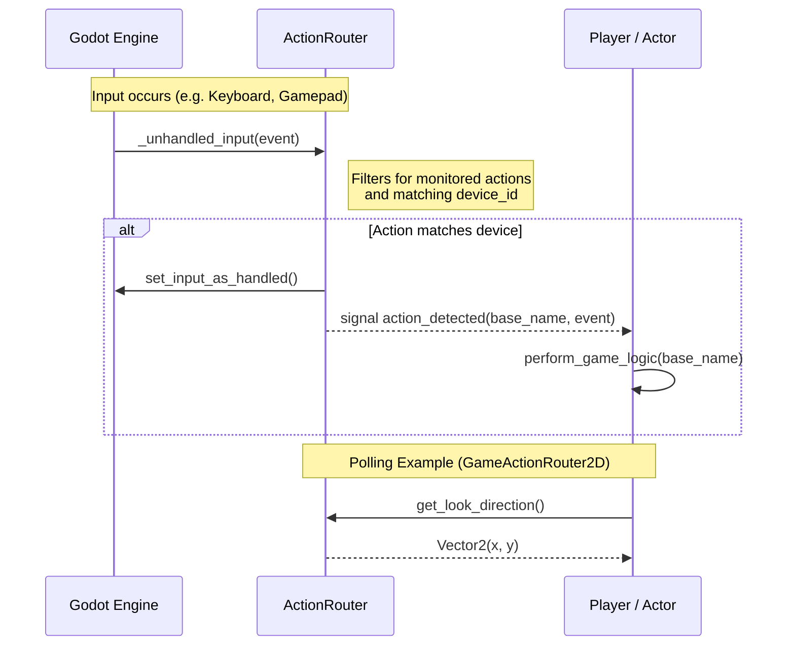

# Input System 🎮

Handling input directly inside your Player script often leads to spaghetti code. This template uses an **Action Router** pattern to keep things clean and multiplayer-ready.

## The Concept

Instead of checking `Input.is_action_pressed("jump")` inside your Player implementation, we separate the "Input" from the "Action".

- **The Router (`ActionRouter`)**: Detects raw inputs (Keyboard, Gamepad, etc.) and maps them to device-agnostic actions.
- **Device Isolation**: The router can automatically clone and prefix actions (e.g., `move_left_device_0`) to allow multiple controllers to work without conflict.
- **The Actor**: Your Player script queries the Router or connects to its signals to react to gameplay intents.

### Signal Flow

## Why do this?

- **Multiplayer Ready**: Easily assign `device_id` to different players. The template handles the `InputMap` cloning for you.
- **Input Neutrality**: Swap between Human, AI, or any other inputs by swapping the `ActionRouter` node.
- **Testing**: Mock inputs easily by calling `action_detected.emit()` from your test scripts.
- **Hybrid Look Logic**: `GameActionRouter2D` automatically switches between Mouse and Gamepad look logic depending on the last used device.

## Files

- `action_router.gd`: The base class. Handles the heavy lifting of `InputMap` cloning and device filtering.
- `game_action_router_2d.gd`: Adds high-level features like normalized look-direction sensing (Mouse absolute vs. Stick relative).
- `game_action_router_3d.gd`: First/third-person 3D router with captured-mouse look, jump, and sprint support. Inspired by [Brackeys' ProtoController](https://github.com/Brackeys/brackeys-proto-controller).