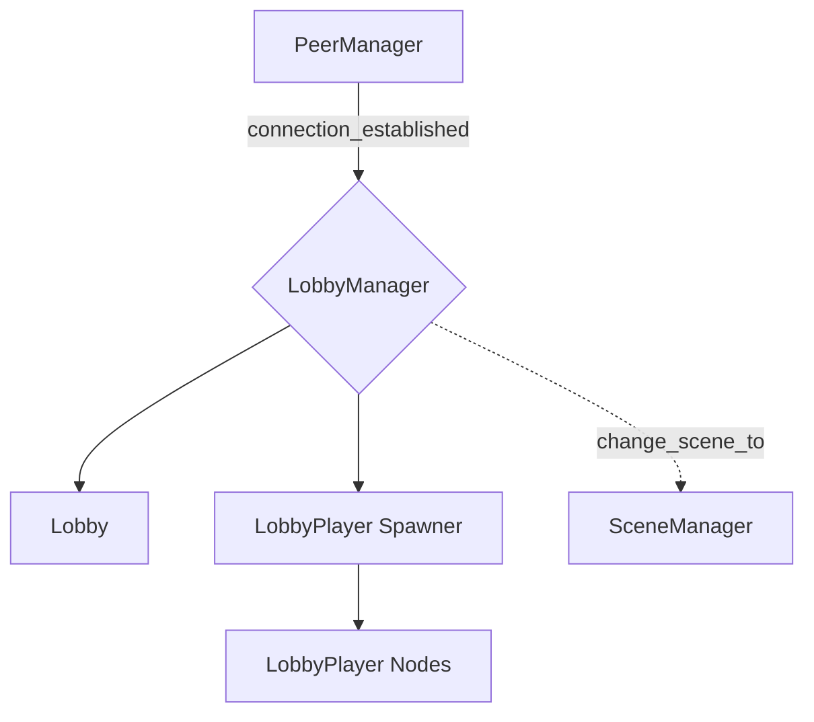

# Lobby System 👥

The `lobby/` folder contains the data responsible for tracking players in the multiplayer session and their status. It also announces the current scene to all players.

## 📂 Components

-   [`Lobby`](Lobby.md): Defines the overall state and properties of the active game session.
-   [`LobbyManager`](LobbyManager.md): Orchestrates the lobby lifecycle, handling player joins/leaves, status updates, and scene transitions.
-   [`LobbyPlayer`](LobbyPlayer.md): Represents an individual player within the lobby, tracking their name and status.

## 🏗️ Architecture Overview

