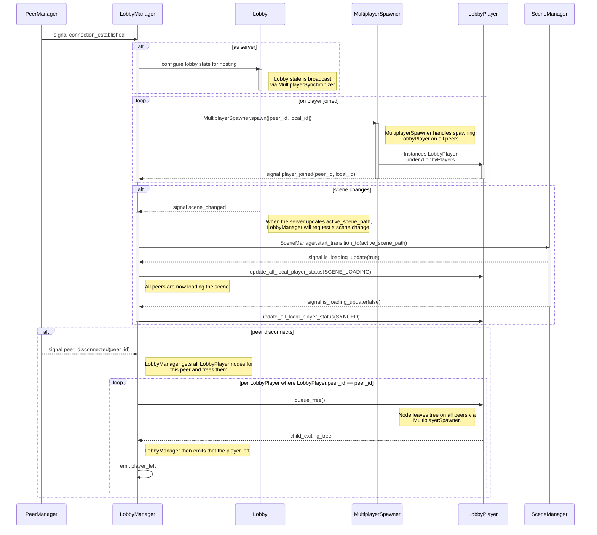
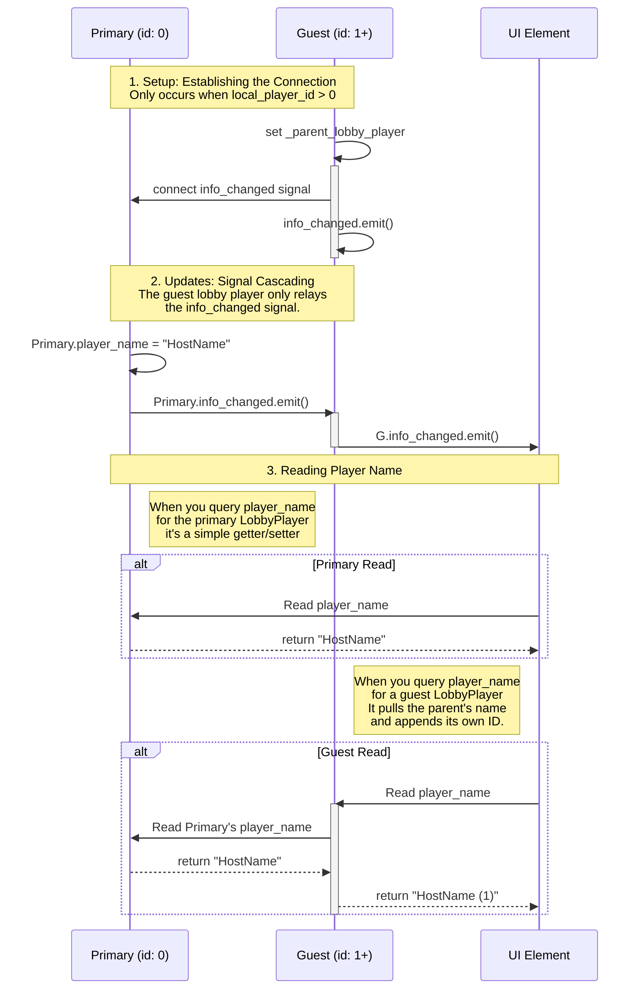

# Lobby System 👥

This folder contains the nodes for tracking connected players and their name/status in a multiplayer session. The lobby is also responsible for announcing the current scene to all players.

## 📂 Components

-   [`LobbyManager`](./lobby_manager.gd): This autoload orchestrates the lobby & lobby player lifecycles, handling player joins/leaves, status updates, and it leverages [SceneManager](../../core/README.md) for scene transitions.
    - The [Lobby](./lobby.gd) node is a data container that represents the current lobby status and the active map.
-   [LobbyPlayer](./lobby_player.gd): Represents a single player (a "node" under a network peer).
    - **Identity**: Each player is uniquely identified by the combination of `peer_id` and `local_player_id`.
    - **Naming**: Primary players (`local_player_id == 0`) have a configurable name. Guest players (`local_player_id > 0`) automatically derive their name from their parent (Primary) player.
    - **Synchronization**: Managed by [MultiplayerSynchronizer](https://docs.godotengine.org/en/stable/classes/class_multiplayersynchronizer.html).

## 🏗️ Architecture Overview

```mermaid
sequenceDiagram
    participant PM as PeerManager
    participant LM as LobbyManager
    participant LN as Lobby
    participant MS as MultiplayerSpawner
    participant LP as LobbyPlayer
    participant SM as SceneManager

    PM->>LM: signal connection_established
    activate LM
    alt as server
        LM->>LN: configure lobby state for hosting
        activate LN
        Note right of LN: Lobby state is broadcast<br/> via MultiplayerSynchronizer
        deactivate LN
    end
    loop on player joined
        LM->>MS: MultiplayerSpawner.spawn([peer_id, local_id])
        activate MS
        note right of MS: MultiplayerSpawner handles spawning<br/> LobbyPlayer on all peers.
        MS->>LP: Instances LobbyPlayer<br/>under /LobbyPlayers
        activate LP
        LP-->>LM: signal player_joined(peer_id, local_id)
        deactivate LP
        deactivate MS
    end
    deactivate LM

    alt scene changes
        LN-->>LM: signal scene_changed
        activate LM
        note right of LN: When the server updates active_scene_path,<br/>LobbyManager will request a scene change.
        LM->>SM: SceneManager.start_transition_to(active_scene_path)
        activate SM
        SM-->>LM: signal is_loading_update(true)
        LM->>LP: update_all_local_player_status(SCENE_LOADING)
        note right of LM: All peers are now loading the scene.
        SM-->>LM: signal is_loading_update(false)
        deactivate SM
        LM->>LP: update_all_local_player_status(SYNCED)
        deactivate LM
    end 

    alt peer disconnects
        PM-->>LM: signal peer_disconnected(peer_id)
        Note right of LM: LobbyManager gets all LobbyPlayer nodes for<br/> this peer and frees them
        loop per LobbyPlayer where LobbyPlayer.peer_id == peer_id
            LM->>LP: queue_free()
            Note left of LP: Node leaves tree on all peers via<br/> MultiplayerSpawner.
            LP-->>LM: child_exiting_tree
            note right of LM: LobbyManager then emits that the player left.
            LM->>LM: emit player_left
        end
    end
```

### 🎮 Split-Screen & Guest Players

While a `peer_id` represents a network connection, a `local_player_id` represents a distinct player on that device.

- **Primary Player (`0`)**: The main player associated with the peer.
- **Guest Player (`1+`)**: Additional local players (split-screen). Guests are linked to the Primary player on the same peer via the `_parent_lobby_player` property.

#### Signal Re-emission & Naming

Guest players stay in sync with their Primary player through signal cascading and property resolution inside `LobbyPlayer`.

1. **Signal Connection**: When a guest player is assigned a `_parent_lobby_player`, it automatically connects to the parent's `info_changed` signal.
2. **Cascading**: Any change to the primary player triggers `info_changed`, which the guest catches and re-emits to update their own UI representations.
3. **Getter Resolution**: When the UI reads `player_name`, the getter behaves differently depending on `local_player_id`:
   - If `local_player_id == 0` (Primary), it directly returns the underlying `player_name` String.
   - If `local_player_id > 0` (Guest), it dynamically fetches the parent's name and appends its own ID.

```mermaid
sequenceDiagram
    participant P as Primary (id: 0)
    participant G as Guest (id: 1+)
    participant UI as UI Element

    Note over P, G: 1. Setup: Establishing the Connection<br/>Only occurs when local_player_id > 0
    G->>G: set _parent_lobby_player
    activate G
    G->>P: connect info_changed signal
    G->>G: info_changed.emit()
    deactivate G

    Note over P, G: 2. Updates: Signal Cascading<br/>The guest lobby player only relays<br/>the info_changed signal.
    P->>P: Primary.player_name = "HostName"
    P->>G: Primary.info_changed.emit()
    activate G
    G->>UI: G.info_changed.emit()
    deactivate G

    Note over P, UI: 3. Reading Player Name

    note right of P: When you query player_name<br/> for the primary LobbyPlayer<br/>it's a simple getter/setter
    alt Primary Read
        UI->>P: Read player_name
        P-->>UI: return "HostName"
    end

    Note right of G: When you query player_name<br/> for a guest LobbyPlayer<br/>It pulls the parent's name<br/> and appends its own ID.

    alt Guest Read
        UI->>G: Read player_name
        activate G
        G->>P: Read Primary's player_name
        P-->>G: return "HostName"
        G-->>UI: return "HostName (1)"
    end
    deactivate G
```
