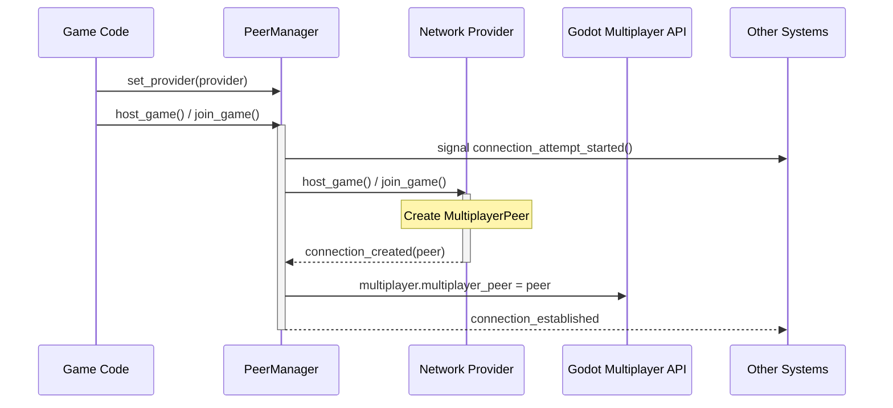

# Network Systems 📡

The `network/` folder contains the core logic for establishing and managing network connections. It provides an abstracted way to handle different multiplayer protocols (like ENet or Steam) through a central `PeerManager` and pluggable `NetworkProvider` implementations.

## 📂 Subsystems

-   [`PeerManager`](peer_manager.gd): The central hub for creating, joining, and shutting down multiplayer sessions, abstracting the underlying network protocol.
-   `providers/`: Contains concrete implementations of network protocols, adhering to the `BaseNetworkProvider` interface.

## 🏗️ Architecture Overview



## 🛠️ Key Components

### `PeerManager` (`peer_manager.gd`)

The `PeerManager` is the single source of truth for the connection state, whether you are hosting or joining a game. It orchestrates the lifecycle of the `MultiplayerPeer` by delegating to an active `BaseNetworkProvider`.

-   **Signals**:
    -   `connection_attempt_started`: Emitted when a connection process begins.
    -   `connection_established`: Emitted when a server starts or a client successfully connects.
    -   `connection_shutdown(reason: String)`: Emitted when a connection ends or fails.
-   **API**:
    -   `set_provider(provider: BaseNetworkProvider)`: Configures the `PeerManager` to use a specific network implementation (e.g., `ENetNetworkProvider`).
    -   `host_game()`: Initiates a hosting session via the active provider.
    -   `join_game()`: Initiates a client connection to a hosted game via the active provider.
    -   `shutdown()`: Cleans up the current connection and peer.

**Example Usage**:

```gdscript
PeerManager.set_provider(ENetNetworkProvider.new())
PeerManager.host_game()
PeerManager.join_game()
PeerManager.shutdown()
```

### Network Providers (`providers/`)

This directory contains different implementations of how to establish a network connection. All providers extend `BaseNetworkProvider`.

#### `BaseNetworkProvider` (`providers/base_network_provider.gd`)

An abstract class that defines the interface for all network providers. Concrete providers must implement methods like `host_game()`, `join_game()`, and `shutdown()`, and emit `connection_created` or `connection_failed` signals.

#### `ENetNetworkProvider` (`providers/enet_network_provider.gd`)

This provider uses Godot's built-in ENet protocol. It supports connections via IP address and port, making it suitable for direct connections and local testing.

#### `SteamNetworkProvider` (`providers/steam_network_provider.gd`)

This is a skeleton provider intended for integration with Steamworks (e.g., using a GodotSteam wrapper). It demonstrates how you could extend the system to support Steam lobbies and P2P networking, but requires further implementation.