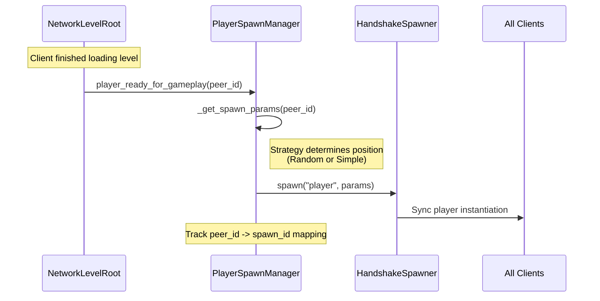

# Player Spawning 📍

The **Player Spawning System** manages the lifecycle of player characters within a game level. It bridges the gap between lobby management and in-game representation by coordinating with the [Replication System](../replication/README.md).

## 🏗️ Architecture

The system uses a **Strategy Pattern** to determine how and where players appear. 

- **The Manager (`BasePlayerSpawnManager`)**: An abstract base class that listens for gameplay readiness and orchestrates the spawn/despawn process.
- **The Spawner (`HandshakeSpawner`)**: Performs the actual network instantiation of the player scene.
- **Strategies**: Specific implementations that define the "where":
    - `SimplePlayerSpawnManager`: Passes only the `peer_id`. Useful when the player scene handles its own placement.
    - `RandomPlayerSpawnManager`: Picks a random child from a designated `spawn_points` node.

## 🔄 Spawning Flow

## 🛠️ Components

### `BasePlayerSpawnManager` (Abstract)
The "Brain" of the operation. It connects to `NetworkLevelRoot` and `LobbyManager` to handle player entry and exit.
- **Signal**: `player_ready_for_gameplay` triggers the spawn.
- **Cleanup**: Automatically despawns the player's network object when they leave the lobby.

### `RandomPlayerSpawnManager`
Best for deathmatches or shared maps.
- **Setup**: Create a Node (e.g., "SpawnPoints") and add `Marker2D` or `Node3D` children at your desired locations.
- **Export**: Assign that parent Node to the `spawn_points` property.

### `SimplePlayerSpawnManager`
Minimalist approach.
- **Logic**: Only provides the `peer_id` to the spawner.
- **Use Case**: When players spawn at a fixed location or if the player scene contains its own entry logic.

## 🔌 Integration

1.  Add a **Spawn Manager** (e.g., `RandomPlayerSpawnManager`) to your level scene.
2.  Assign the `NetworkLevelRoot` and `HandshakeSpawner` references.
3.  Ensure the `player_spawner_label` matches a configured resource in your `HandshakeSpawner`.
4.  If using `RandomPlayerSpawnManager`, assign your container of spawn markers to `spawn_points`.

## 🆕 Custom Strategies

To create a new spawning rule (e.g., Team-based spawning, Distance-based spawning):
1.  Extend `BasePlayerSpawnManager`.
2.  Override `func _get_spawn_params(peer_id: int) -> Dictionary`.
3.  Return a dictionary containing at least `"peer_id": peer_id`.